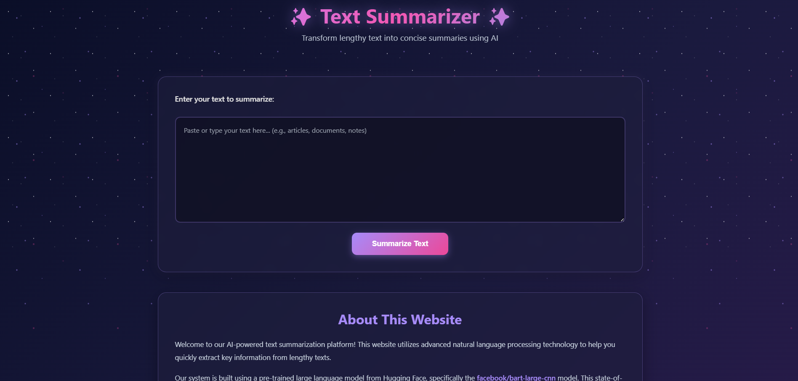

# Text Summarizer (Flask + BART)

   

A full-stack web application that summarizes long-form text using a **hybrid extractive + abstractive pipeline**. Extractive scoring (TF-IDF with n-grams) identifies the most information-dense sentences, while abstractive summarization (Facebook's `bart-large-cnn` model from Hugging Face) generates a fluent, human-readable summary from chunked input.

## Features

- Hybrid summarization: TF-IDF extractive scoring + BART abstractive generation
- Automatic chunking for long texts that exceed the model's token limit
- Simple REST API (`/api/summarize`) built with Flask
- Lightweight vanilla JS/HTML/CSS frontend — no framework overhead
- One-click copy-to-clipboard for results
- Input validation (rejects text under 50 characters)

## How It Works

1. **Preprocess** — strip URLs, special characters, and normalize whitespace.
2. **Extractive pass** — score sentences with TF-IDF (unigrams + bigrams) to surface key content.
3. **Chunk** — split long text into model-sized chunks (~900 tokens) so nothing gets truncated.
4. **Abstractive pass** — feed each chunk through BART (`facebook/bart-large-cnn`) with beam search and repetition blocking.
5. **Merge** — concatenate chunk summaries into the final result and return it to the frontend.

## Example



## Requirements

- Flask==3.1.3
- flask-cors==6.0.5
- numpy==2.0.2
- scikit-learn==1.6.1
- transformers==5.13.1
- torch==2.11.0+cpu

## How to Run

1. Clone the repository:
   ```bash
   git clone https://github.com/JanaM-10/text-summarization-app.git
   cd text-summarization-app
   ```
2. Install dependencies:
   ```bash
   pip install -r requirements.txt
   ```
3. Start the Flask backend:
   ```bash
   python app.py
   ```
   Server runs at `http://127.0.0.1:5000/`.
4. Open `frontend/index.html` in your browser and paste in text to summarize.

Or call the API directly:
```
POST http://127.0.0.1:5000/api/summarize
Content-Type: application/json

{ "text": "Your long text goes here..." }
```
Response:
```json
{ "summary": "The generated summary..." }
```

## Future Improvements

- Deploy the Flask backend (Render/Railway) so the frontend works without a local server
- Add a text-length/summary-length ratio slider for user control
- Support file upload (.txt/.pdf) instead of paste-only input
- Cache repeated requests to reduce inference time
- Add unit tests for the preprocessing and chunking functions

---
*Built as part of ongoing self-study in NLP and applied transformer models.*
